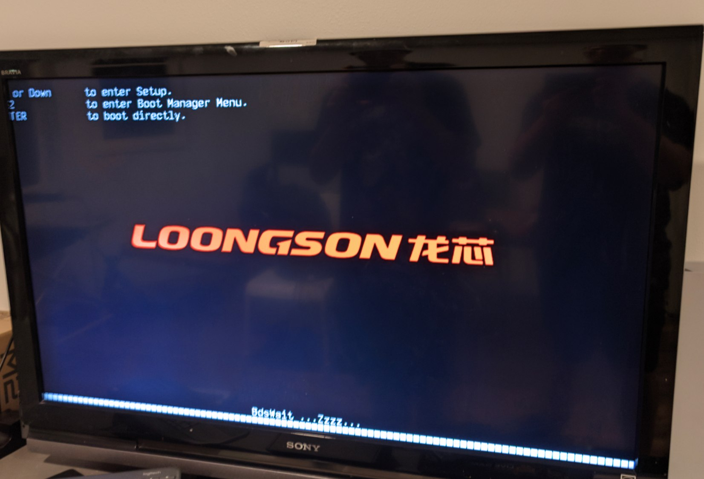

# 龙芯 3A5000 体验报告

## 前言

编者注：

本文是社区贡献者 [千须末 (OriginCode)](https://github.com/OriginCode)
在九月初完成编写的。当时考虑到目前社区正与龙芯中科的工程师协同调试使用过程中遇到的问题，我们不希望在有关问题得到解决或得出初步结论之前草率地进行讨论或吐槽。十二月初，我们将使用龙架构
(LoongArch)
完成日常工作、系统移植和与官方人员协作的过程中发现的问题整理成了《社区报告：关于改善龙芯中科与社区协作的几点观察和意见》并递交给了龙芯官方的领导并得到了积极回应。

因此，本文反映的是九月初我社初步完成龙架构移植时的系统使用体验。文中提到的几个问题，有解决方法的，我们均在下面标注了问题出现的原因和解决方法，可供参考。

## 相遇

暑期回国，正好赶上久违的线下 AOSCC，于是赶紧去凑了个热闹。今年的 AOSCC
有抽奖环节，我当然非常感兴趣，可惜前面几轮抽奖都没我的份。最后一轮了，奖品是由
Revy 带来的龙芯 3A5000 台式主机。

「36号！」

诶嘿，这不是我吗！我飞一般地跑上台，抱得美机归。回家后，我兴奋地思考着往后与它的种种。

## 第一回

暑假过后，我乘飞机前往美国，我带着这小巧的机器一路颠踣到了西雅图。

开箱，检查------没有硬盘，不过问题不大，我们先尝试点亮这台机器。额，等下，这电源看起来有点奇怪------

> 输入电压：180~360V

Wow，正好不能用（美国一般标准电压为 110-120V，中国的为
220V）。我四处寻觅，最后找室友借走了他闲置 ATX
主机上的电源。虽然由于尺寸问题放不进机箱，不过好歹也是能用了。

接上电视，上电、开机。过了半分钟，电视屏幕亮了，随之亮起了红色的「Loongson
龙芯」徽标，进度条旁写着「...Zzzz...」（不清楚用意为何）。不知为何，这块显卡输出在
BIOS 界面下有问题，显示内容会超出 1080p
一部分，但这毕竟是小问题，无伤大雅。能点亮了，机器没问题，于是准备过几天前往好友家中一起把玩一下这台来自东方的神秘机器。

### 启动安装

到了好友家里，从他家掏了一块 SATA SSD，下载最新的 AOSC OS
LiveKit------开装！

写入 U 盘，启动
LiveKit，似乎内存测试会循环启动，开机的时候取消掉就行。进入系统便是 MATE
桌面；桌面上缺少了系统安装程序图标，因为当前 LoongArch64 架构的 LiveKit
尚未包含这个组件。不过没问题，我们打开终端，开始手动安装（不过也许可以先在别的电脑上解焦油球（tarball）再进行后续安装操作，因为
LA64 SATA 控制器实在是有点慢）。

> 编者注：本文是在九月初编写的，当时 AOSC OS 的 DeployKit
> 安装程序尚未支持龙架构 (LoongArch)，10 月底发布的 LiveKit
> 已经包含安装程序且可以正常使用。

此外，毫无意外地，安装过程中体验到了数次 AOSCC 2023 上 3A5000
演示机上出现的同款「千字节跳动」。

> 编者注：所谓「千字节跳动」实际上是龙架构内核中 AMDGPU 显卡驱动写合并
> (writecombine) 实现问题导致的纹理损坏，此问题已在十月中旬通过我社开发者
> [Icenowy Zheng](https://github.com/Icenowy) 提交的
> [上游补丁](https://git.kernel.org/torvalds/c/278be83601dd1725d4732241f066d528e160a39d)
> 得到解决。6.6 版 Linux 内核已包含此修复。

### 初体验

安装完成。AOSC OS，启动！

简洁的开机动画过后，便是优雅的 SDDM 登录界面。登录后便能开始使用 KDE
Plasma 桌面。

装完的系统似乎没有了 LiveKit 的千字节跳动现象，为系统打开了 `frontier`
软件源以体验正在施工中的 LoongArch
主线移植预览。更新系统重启后，我们便开始寻思这玩意儿上面能玩点啥。启动器菜单里有些游戏，于是我打开了
Minetest（Minecraft 的开源仿制品），想试玩一下。创建世界，进入世界......
Boom！Minetest 崩溃了。好吧，看来不是很好玩。

尝试排错了一下，发现似乎是游戏的网络栈出了问题导致了段错误，因为
Minetest 和 Minecraft
一样，即使是本地单人游戏，也需要创建一个本地服务器，然后从本地客户端连接到本地服务器游玩。这个问题可能需要进一步打补丁处理，咱们暂且不管。

### 初次打包 Telegram Desktop

> 其实社区有 LoongArch 构建服务器，但是那时的我没有想到这回事。

游戏不好玩，那我们来玩打包。

正愁 LoongArch64 上没有 Telegram
客户端用，不如我们自己来打一个。那怎么打呢？好问题，AOSC OS
的容器化打包工具 [Ciel](https://github.com/AOSC-Dev/ciel-rs) 在
`frontier` 源内并没有包，于是得手动编译源代码。从 GitHub
上克隆下仓库，执行 `cargo build --release`，应该就能有 Ciel
用了，对吧......？

并不！

    error: could not compile `nix` (lib) due to 4 previous errors

这是因为 Ciel 这个 Rust 程序有四个间接或直接依赖的库依赖了旧版的
`nix`（Rust 的 *nix 系统 API 绑定库），而这个旧版的 `nix` 不包含
LoongArch 支持，所以得强行给这些库升级依赖。

此时朋友不禁吐槽：「你为了吃蛋糕得先开个蛋糕店。还得把批萨店改成蛋糕店。」

一番折腾之后，总算有了一块能吃的「蛋糕」（至于有没有重金属超标什么的我不知道），开始打包。然后
Telegram
便又因为内部组件缺少架构支持导致编译错误，需要打架构支持补丁。写上补丁后，还是打不出来，遂放弃，使用比较脏的手段打了出来。至于
Telegram 本身...... 第一次编译的时候，原本带的 8G
内存表示承受不住，内存不足编译失败。只好开始加内存。

### 鬼故事之一：加内存

好友从他家里翻出了一些 DDR4 内存条，先尝试了一下 8+16 的组合，GRUB
表示不开心，直接卡在了龙芯 LOGO 上，无法进入系统。于是尝试了一下 16+16
的组合，还是一样的问题。只有 8+8
能正常启动。从社区群里了解到，这玩意儿挑内存，估计是不喜欢吃我们的内存吧。

> 编者注：龙架构设备上内存兼容性不佳的问题已众所周知，我们也与龙芯中科接触请求获取官方支持列表；此外，我们也就内存支持和支持列表等资料公开等问题向龙芯中科领导递交了一份《社区报告：关于改善龙芯中科与社区协作的几点观察和意见》，至截稿时收到官方的积极回复，相信来年这些问题会得到逐步解决。

8+8 倒也能用，顺便开了一下 swapfile
防止因为内存不足再次打包失败。可惜，最后还是没能成功编译，只好等社区其他同事研究了。

> 编者注：现在 AOSC OS 已包含功能完整的，为 LoongArch 编译的 Telegram
> 软件包 (`telegram-desktop`)；Ciel 容器管理工具也已支持 LoongArch。

### 鬼故事之二：从 SATA SSD 迁移到 M.2 NVMe SSD

打包和装机的时候体验到了这玩意儿恐怖的 SATA
读取速度，看不过眼的朋友从包里掏出了两根 M.2 NVMe SSD，希望能改善存储
I/O。我们便从 SATA 盘将系统克隆到 NVMe 盘上，顺便吃个饭。

吃完饭，系统已经克隆好了。装上、开机------无法挂载系统分区......？我以为可能是
UUID 不知道怎么变动了，需要手动改写 `/etc/fstab`
重新标记分区挂载配置。正当我启动 LiveKit，修改系统中 `/etc/fstab`
后保存的时候，编辑器居然提示 `read-only filesystem`？！噔噔咚，退出
编辑器用 `dmesg` 查阅内核日志：一大堆的 BTRFS 写入错误。这 Bugfs
不会这就凉了吧......
但是奇怪的是，我们甚至不能创建新分区（修改分区表）。难道是 NVMe
硬盘写入支持有问题？「又被创到了」。

> 编者注：NVMe 无法写入是这台台式机中使用的天创者 ML5A
主板的固件问题导致的，后来发布的
[stable2305](https://github.com/loongson/Firmware/blob/main/5000Series/PC/ML5A/UDK2018-LoongArch-ML5A-V4.0.05170-stable202305-Gmem-dbg.fd)
版本固件修复了这一问题。

### 鬼故事之三：Above 4G

NVMe 工作不正常，我们便开始折腾 BIOS 选项尝试排查问题，看到了 PCIe Above
4G 的选项是关着的，便想打开尝试一下，然后重启电脑。

过了许久，电视上一点反应都没有。问了群友才知道这东西开 Above 4G
会直接爆炸（那能不能直接不留这个选项......）。更创的是，无法通过卸电池来重置
BIOS，因为写到非易失储存里了，也没有方便的重置手段，只能买编程器重刷固件。

额，好吧。

*第一回 终*

## 第二回

一周过去，摆在朋友家的机器已经被朋友拿编程器救活了，可以拿来整点新活了。

### Minecraft

在出发之前，我提前给龙架构打包了 PrismLauncher 这款 Minecraft
启动器，为的就是尝试在这台机器上跑 Minecraft。当然，这款游戏在 LoongArch
上不可能开箱即用，因为 Minecraft 所用的 LWJGL
库需要自己本地编译。通过询问社区好友得知，龙芯群群友
[Glavo](https://github.com/Glavo) 之前给另一款 Minecraft 启动器 HMCL
做适配的时候已经把 LWJGL 打好补丁编译好了；从 GitHub 上下到了编译好的
`.so` 文件后，设置好 Java 的启动参数让其使用预编译的 LWJGL
库路径，便成功启动了 Minecraft。

只是启动当然不够，最重要的还是验证一下这机器能否玩游戏------于是，我登录服务器，开始游玩。进入服务器，游戏帧率在加载地图的时候会掉得比较厉害，大概在
20-30 FPS 左右，估计是 CPU 瓶颈。当地图加载完毕后，帧率可以达到 50
以上，这时按 F3 查看性能数据，发现 GPU
的占用率满了。果然亮机卡还是不太撑得住。

于是，朋友翻出了一张十年前的 AMD Radeon R9 270
游戏显卡给这台机器装上，Minecraft 的帧率便达到了 60 FPS
的水平。  当然，一帧能玩，两帧流畅，三帧电竞  

那，如果我们更过分一点呢？

翻出 Minecraft 光影包 Complementary
Reimagined，在开了这个光影的情况下甚至也能达到 30 FPS 的水平。查看 F3
侦错屏幕，发现依旧是 GPU 的瓶颈（后来我又换了更高级的 AMD Radeon RX 470
显卡，帧率能达到 60 FPS 以上的水平）。

可以说，在不玩大型模组整合包和不加载大量实体（Entity，Minecraft
中的可交互物体）的情况下，这个 CPU 的性能基本是足够游玩的。

### DOOM 与 Quake III

Minecraft 整完了，好友又开始搞起了《毁灭战士 (DOOM)》，选用了 Chocolate
DOOM 的移植，在本地编译后便能游玩（在国外，DOOM
常被用作验证机器游戏性的标准）。

另外一款被拿来实验的游戏是《雷神之锤 III (Quake III
Arena)》。这款游戏使用 ioquake3 引擎，体验也十分不错。

*第二回 终*

### 结语

总地来说，这台龙芯 3A5000 机器在游戏之外，桌面体验也十分不错，KDE Plasma
5 在日用情况下没有什么卡顿，Firefox 浏览器播放 1080p
视频也是游刃有余。在满足日常使用及办公用的基本任务上，这台机器可以说是「干得十分漂亮」。虽然还有一些奇怪的小毛病，但相信这些问题经过时间的推移会逐步得到解决，使用体验也会日趋完善。
